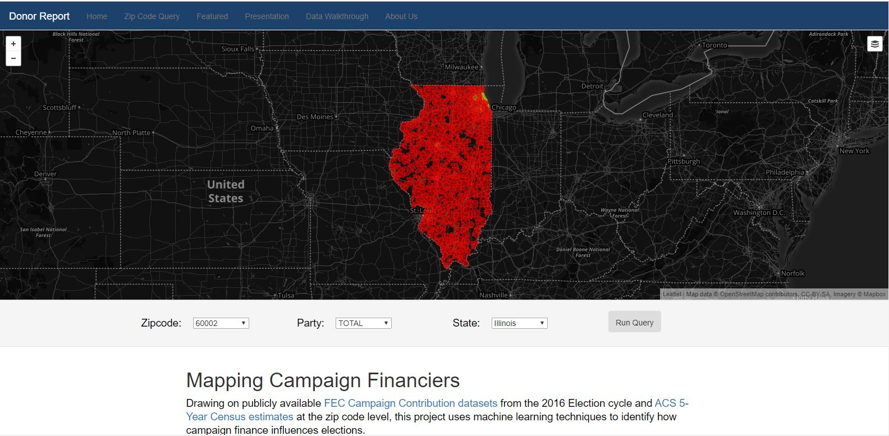
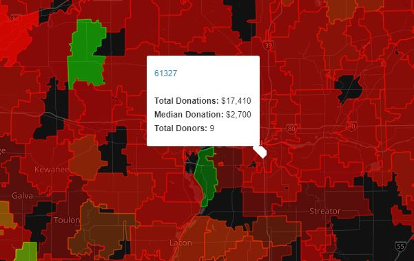

# Campaign Contribution Machine

The past few federal election cycles have demonstrated the significance of attracting a broad base of individual donors. This project is an interactive mapping system designed to help political campaigns tailor their efforts by location. It combines the 3.5 million individual donations recorded by the FEC (for each 2 year federal election cycle) with 163 demographic markers recorded by the US Census in order to build a deep learning model that can predict how much a given zip code is likely to donate and to which party. If this number is substantially lower than the actual donations from that location, this may indicate an untapped pool of potential donors and thus help campaigns to direct their outreach more effectively.

## Getting Started

A live version of this project, running on data for Illinois specifically, can be found [here](https://campaign-contributions.herokuapp.com "Finance your Campaign").

Please note that the map may take 5-8 seconds to load.

There are three initial overlays available for Illinois which can be toggled using the button in the top right corner of the map. Switching overlay will update the colors on the map.

Clicking on a specific zipcode will produce a popup with specific details on the chosen zipcode. Clicking on the name of the zipcode within the window will redirect to a more detailed description of that zipcode including demographic information.

It is also possible to filter donations to candidates associated with a specific party using the dropdown below the map. Selecting either Republican or Democratic donations will also provide additional map overlays based on the deep learning model predictions. The Potential Priority Districts overlay shows which zipcodes have a substantially lower donation total than our model would expect for a district of its demographics. These districts may represent untapped pools of donors for the given party.

## Built With

* Python and Pandas to create an ETL pipeline that combined individual contribution data from the Federal Election Commission with demographics pulled from the US Census API
* Tensorflow was then used to build a deep learning model to predict a given zipcode’s likely quartile for individual donations
* These tables were then loaded into a SQLite relational database
* The final webpage was built around a Flask app, using SQLAlchemy to interface with the database, Javascript and Leaflet to provide interactive maps, and Bootstrap and HTML to create the page templates
* The site is currently hosted on Heroku

## Authors

* Alexander Lecocq (Python, SQL, Javascript)
* Stephen Monteiro (HTML, CSS, Javascript)
* Brickey LeQuire (SQL, AWS)

## Acknowledgments

* Thank you to Chris Gombas, Daisy Li, and Kerry Kurcz for their help during this project
